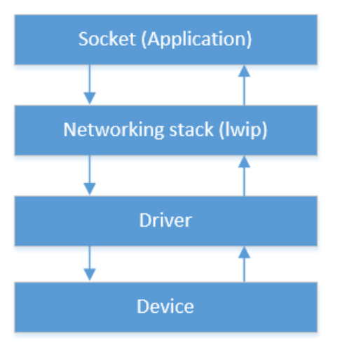
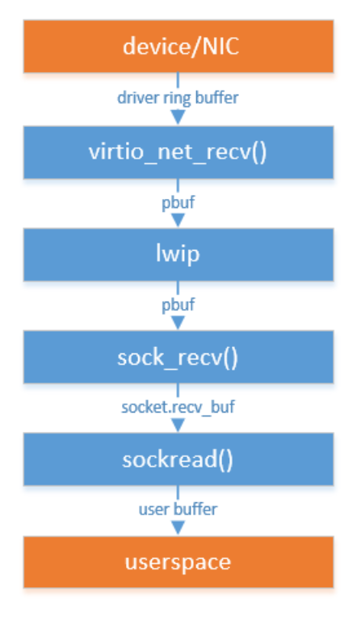
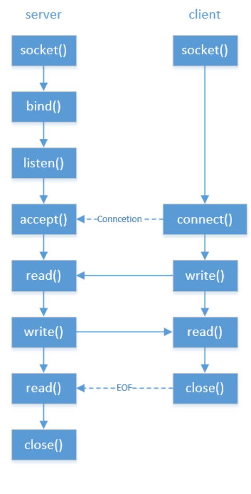

# Project TinyNet

## Overview
Project TinyNet extends the xv6 operating system, a Unix-like educational system, by adding a network module which lacks in the original xv6. Our implementation includes a virtio-net NIC driver to facilitate communication outside QEMU and a BSD-like socket interface. We've evaluated the system for correctness and performance and documented both aspects.

## Features
- **Virtio-net NIC Driver**: Implementation using minimal setup via virtio standards for virtualized devices.
- **Client and Server Sockets**: Based on BSD socket design using the lightweight IP stack (lwIP).
- **Correctness and Performance Tests**: Includes tests to verify the system's functionality and to benchmark its performance.

## System Architecture
<div align="center">
  
  <p><em>Figure 1: Network Architecture showing interaction between device, driver, networking stack, and applications.</em></p>
</div>

<div align="center">
  
  
  <p><em>Figure 2: Data Transmission showing how data is transmitted from devices to the userspace.</em></p>
  <p><em>Figure 3: Socket Flows showing the interaction between server-side and client-side sockets.</em></p>
</div>

## Installation
1. Ensure you have QEMU installed on your machine. Visit [QEMU](https://www.qemu.org/) for installation instructions.
2. Clone the repository to your local machine:
```bash
git clone https://github.com/yourusername/project-tinynet.git
```
3. Navigate into the project directory:
```bash
cd project-tinynet
```
## Usage
To start the xv6 with the new network system, run:
```bash
make qemu-nox
```
This command builds the project and starts the xv6 operating system in QEMU without a graphical interface.

## Testing
- **Driver Test**: Verifies the IP address assigned by DHCP.
- **Socket-client Test**: Includes a 'daytime' program to fetch and display time from a network time server.
- **Socket-server Test**: Implements a 'ping-pong' test to verify message sending and receiving capabilities.

## Performance
The system performance is measured by the response times of the client and server implementations using the 'ping-pong' test. Our results indicate that while the server-side has slower response times possibly due to intensive lock calls, the client-side performs faster than a typical Windows socket implementation.

| Client-side | Server-side   | Time (ms) |
|-------------|---------------|-----------|
| xv6         | remote-server | 1040      |
| Docker      | xv6           | 9291      |
| Windows     | remote-server | 2604      |

*Table 1: Time spent in each scenario.*

## Authors
- Yuchen Cao
- Yicheng Jin
- Xuanting Chen

## License
This project is not licensed, hence, all copyrights are reserved.

## Acknowledgments
- Inspired by the work on xv6 and the networking stack enhancements in various Unix-like operating systems.
- Special thanks to the lwIP community for providing a robust lightweight IP stack.

## References
- [QEMU](https://www.qemu.org/)
- [xv6](https://pdos.csail.mit.edu/6.828/2012/xv6.html)
- [lwIP](https://www.nongnu.org/lwip/2_1_x/index.html)
- [BSD Sockets](https://www.freebsd.org/docs/)
- [Virtio I/O Device](https://courses.cs.washington.edu/courses/cse451/21au/readings/virtio.pdf)

## About xv6
xv6 is a re-implementation of Dennis Ritchie's and Ken Thompson's Unix
Version 6 (v6).  xv6 loosely follows the structure and style of v6,
but is implemented for a modern RISC-V multiprocessor using ANSI C.

ACKNOWLEDGMENTS

xv6 is inspired by John Lions's Commentary on UNIX 6th Edition (Peer
to Peer Communications; ISBN: 1-57398-013-7; 1st edition (June 14,
2000)). See also https://pdos.csail.mit.edu/6.828/, which
provides pointers to on-line resources for v6.

The following people have made contributions: Russ Cox (context switching,
locking), Cliff Frey (MP), Xiao Yu (MP), Nickolai Zeldovich, and Austin
Clements.

We are also grateful for the bug reports and patches contributed by
Takahiro Aoyagi, Silas Boyd-Wickizer, Anton Burtsev, Ian Chen, Dan
Cross, Cody Cutler, Mike CAT, Tej Chajed, Asami Doi, eyalz800, Nelson
Elhage, Saar Ettinger, Alice Ferrazzi, Nathaniel Filardo, flespark,
Peter Froehlich, Yakir Goaron,Shivam Handa, Matt Harvey, Bryan Henry,
jaichenhengjie, Jim Huang, Matúš Jókay, Alexander Kapshuk, Anders
Kaseorg, kehao95, Wolfgang Keller, Jungwoo Kim, Jonathan Kimmitt,
Eddie Kohler, Vadim Kolontsov , Austin Liew, l0stman, Pavan
Maddamsetti, Imbar Marinescu, Yandong Mao, , Matan Shabtay, Hitoshi
Mitake, Carmi Merimovich, Mark Morrissey, mtasm, Joel Nider,
OptimisticSide, Greg Price, Jude Rich, Ayan Shafqat, Eldar Sehayek,
Yongming Shen, Fumiya Shigemitsu, Cam Tenny, tyfkda, Warren Toomey,
Stephen Tu, Rafael Ubal, Amane Uehara, Pablo Ventura, Xi Wang, Keiichi
Watanabe, Nicolas Wolovick, wxdao, Grant Wu, Jindong Zhang, Icenowy
Zheng, ZhUyU1997, and Zou Chang Wei.

The code in the files that constitute xv6 is
Copyright 2006-2020 Frans Kaashoek, Robert Morris, and Russ Cox.

ERROR REPORTS

Please send errors and suggestions to Frans Kaashoek and Robert Morris
(kaashoek,rtm@mit.edu). The main purpose of xv6 is as a teaching
operating system for MIT's 6.S081, so we are more interested in
simplifications and clarifications than new features.

BUILDING AND RUNNING XV6

You will need a RISC-V "newlib" tool chain from
https://github.com/riscv/riscv-gnu-toolchain, and qemu compiled for
riscv64-softmmu. Once they are installed, and in your shell
search path, you can run "make qemu".